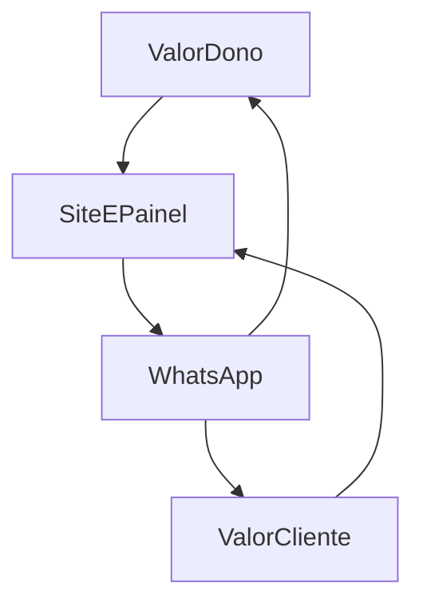

# Mapa de Valor — Dono vs Cliente

## Valor para o dono (primário)

| Necessidade | Como o produto entrega |
| --- | --- |
| Pedidos organizados | Pedido nasce no site com itens, total, modalidade (retirada/entrega local), contato |
| Menos caça no WhatsApp | Painel lista o que precisa de ação; WhatsApp leva contexto |
| Estoque mental → estoque mínimo | Disponibilidade básica no catálogo; pausar produto esgotado |
| Agenda do dia | Serviços com horário e status |
| Rotina previsível | Checklist operacional do dia — ver [[05 - WhatsApp e Operação/03 - Rotina Diária do Dono\|Rotina Diária]] |

## Valor para o cliente (secundário)

| Necessidade | Como o produto entrega |
| --- | --- |
| Ver o que a loja oferece | Vitrine + catálogo |
| Pedir sem enrolação | Carrinho → checkout local |
| Saber se é da cidade | Bloqueio claro se fora da área |
| Marcar serviço | Fluxo de agendamento simples |
| Falar com humano | CTA WhatsApp com contexto (produto/pedido/agenda) |

## Trocas conscientes

| Se… | Então… |
| --- | --- |
| Feature encanta o cliente mas aumenta trabalho do dono | Redesign ou corta |
| Automação WhatsApp completa é cara no MVP | Começar com deep link + templates/disparo assistido; evoluir API |
| Multi-loja atrasa o primeiro valor | Documentar premissas; implementar single-tenant |

## Diagrama mental

## Relacionados

- [[01 - Visão e Problema/03 - Personas|Personas]]
- [[01 - Princípios de Decisão]]
