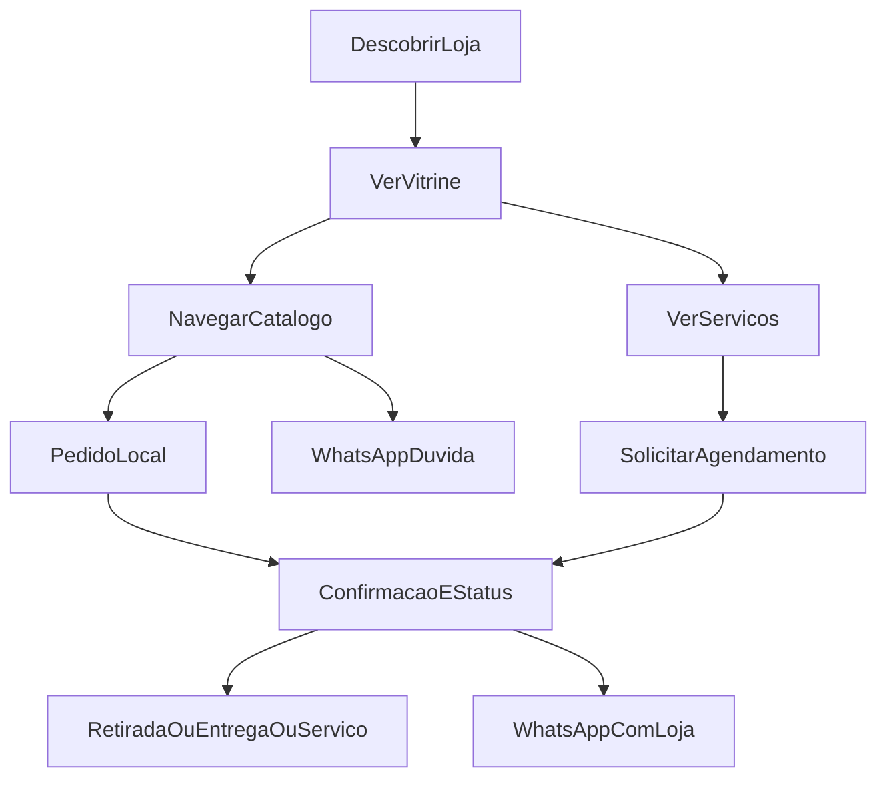

# Jornada do Cliente

## Visão geral

## Etapas

### 1. Descobrir
- Indicação, Google, Instagram, boca a boca → chega no site ZooRações

### 2. Orientar-se (vitrine)
- Entende horários, localização, o que a loja faz
- Escolhe: comprar, agendar ou falar no WhatsApp

### 3a. Comprar (pedido local)
- Catálogo → carrinho → checkout na cidade → confirmação
- Detalhe em [[03 - Pedido Local + WhatsApp]]

### 3b. Agendar serviço
- Escolhe serviço + pet + horário → aguarda confirmação
- Detalhe em [[04 - Agendamento e Serviços]]

### 3c. Só tirar dúvida
- CTA WhatsApp com contexto (produto ou mensagem genérica)

### 4. Cumprir
- Retira, recebe na cidade, ou comparece ao serviço
- Pode receber atualizações via WhatsApp (assistidas pelo dono)

## Momentos de verdade

| Momento | O que não pode falhar |
| --- | --- |
| Checkout | Deixar claro se entrega/retirada é só na cidade |
| Pós-pedido | Cliente sabe que o pedido existe e como falar com a loja |
| Agenda | Cliente sabe se está solicitado ou confirmado |

## Relacionados

- [[02 - Jornada do Dono]]
- [[01 - Visão e Problema/03 - Personas|Personas]]
