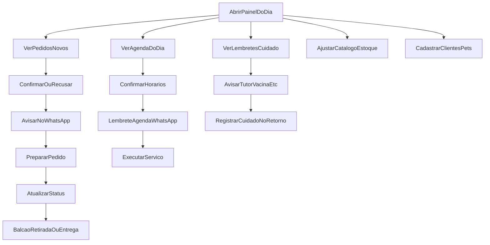

# Jornada do Dono

## Visão geral

## Etapas do dia típico

1. **Abrir o painel** — ver o que precisa de ação
2. **Pedidos** — confirmar, preparar, atualizar status, avisar cliente
3. **Agenda** — confirmar horários, remarcar, marcar no-show/conclusão
4. **Catálogo** — pausar o que acabou; corrigir preço se necessário
5. **Balcão** — fulfillment presencial continua; painel só organiza

## Papel do WhatsApp na jornada do dono

- Não é onde o pedido “mora”
- É onde o dono **comunica** com contexto (número do pedido, horário, status)
- Ideal: um toque no painel abre a conversa certa

Ver [[05 - WhatsApp e Operação/03 - Rotina Diária do Dono|Rotina Diária do Dono]].

## Anti-jornada (evitar)

- Dono precisa copiar itens do chat para uma planilha
- Dono não sabe se já confirmou
- Dono descobre falta de estoque só quando o cliente chega

## Relacionados

- [[01 - Jornada do Cliente]]
- [[03 - Pedido Local + WhatsApp]]
