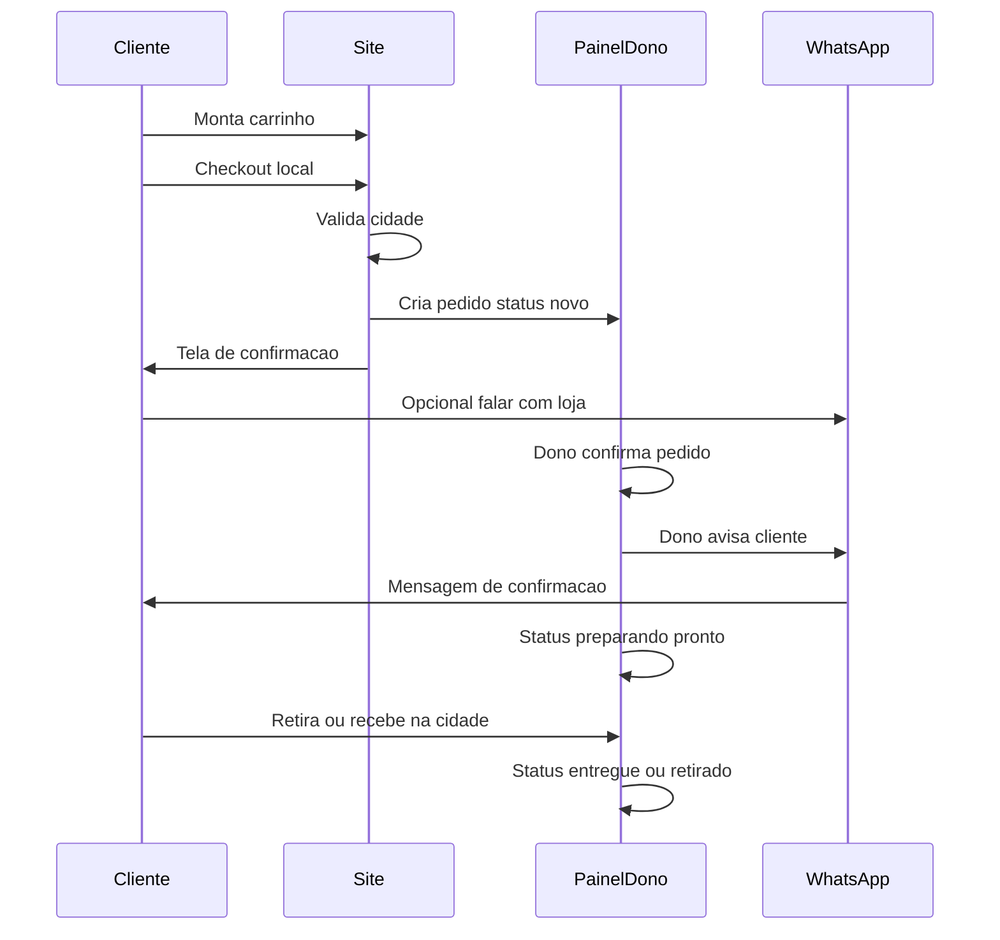

# Pedido Local + WhatsApp

## Fluxo feliz

## Regras

1. Pedido só conclui checkout se modalidade + área forem válidas
2. Status vive no painel/sistema
3. WhatsApp é opcional para o cliente no momento do pedido, mas **recomendado** para o dono na confirmação
4. Mensagem pré-preenchida inclui: nome da loja, nº do pedido, resumo curto, modalidade

## Status do pedido

| Status | Quem move | Significado |
| --- | --- | --- |
| `novo` | Sistema | Acabou de chegar |
| `confirmado` | Dono | Loja aceitou |
| `preparando` | Dono | Em montagem |
| `pronto` | Dono | Pode retirar / sai para entrega |
| `entregue` / `retirado` | Dono | Concluído |
| `cancelado` | Dono (ou regras) | Não segue |

## Integração WhatsApp neste fluxo

| Gatilho | Ação MVP |
| --- | --- |
| Cliente no produto | wa.me com nome do produto |
| Cliente pós-pedido | wa.me com nº do pedido |
| Dono confirma | Botão no painel → mensagem ao telefone do cliente |
| Dono marca pronto | Idem, texto de “pedido pronto” |

Detalhe dos textos: [[05 - WhatsApp e Operação/02 - Mensagens e Gatilhos|Mensagens e Gatilhos]].

## Relacionados

- [[05 - Casos de Borda]]
- [[03 - Escopo do Produto/03 - Requisitos Funcionais|RF-P / RF-W]]
