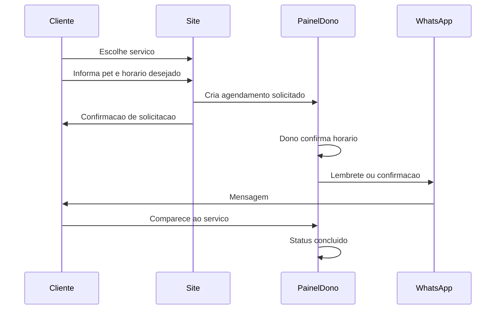

# Agendamento e Serviços

## Fluxo feliz

## Entidades

Agenda consome o cadastro canônico de [[08 - Clientes Pets e Lembretes/01 - Modelo de Domínio|Cliente/Pet]].

| Entidade | Campos mínimos |
| --- | --- |
| Serviço | Nome, duração sugerida, ativo/inativo |
| Pet / Cliente | Ver módulo de cadastro |
| Agendamento | Serviço, pet, cliente, horário, status |

## Status

| Status | Significado |
| --- | --- |
| `solicitado` | Cliente pediu; dono ainda não confirmou |
| `confirmado` | Horário fechado |
| `concluído` | Serviço feito |
| `cancelado` | Não acontece |
| `no-show` | Cliente não compareceu |

## Regras MVP

1. Não precisa ser agenda médica completa — slots simples bastam
2. Dono é a autoridade de confirmação (evita overbooking automático sofisticado no dia 1)
3. Pet vem do cadastro da loja; não é prontuário veterinário
4. WhatsApp para lembrete de agenda: assistido no MVP
5. Lembretes de vacina/cuidado: módulo separado — [[08 - Clientes Pets e Lembretes/03 - Sistema de Lembretes|Sistema de Lembretes]]

## Relação com a loja

Se a ZooRações **não** oferecer serviço agendável no lançamento, o módulo pode ficar oculto na vitrine — mas o modelo permanece documentado.

## Relacionados

- [[05 - Casos de Borda]]
- [[02 - Jornada do Dono]]
