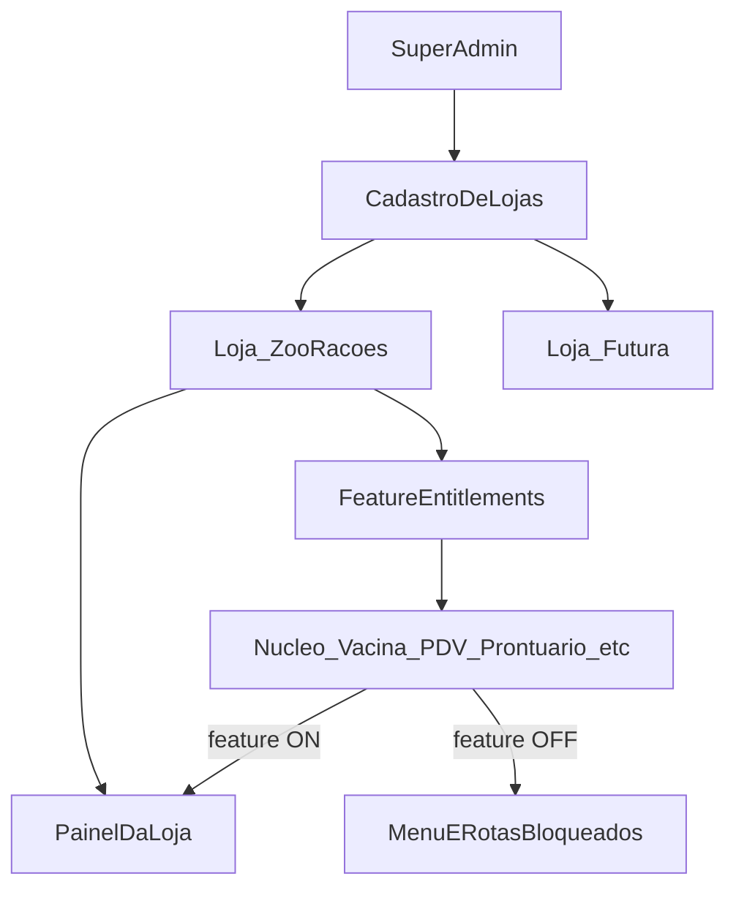

# Super Admin e Feature Entitlements

## Decisão

Vamos ter **desde a fundação**:

1. Painel **Super Admin** (você / plataforma)
2. **Cadastro de loja** (tenant)
3. **Feature Entitlements** por loja — ligar/desligar módulos conforme o produto for sendo configurado

Não vamos ter agora: billing, self-serve, trial, marketplace.

## Modelo mental



- **Super Admin** gerencia a plataforma e as lojas
- **Admin da loja** opera o dia a dia **só com as features liberadas**
- ZooRações é a primeira loja cadastrada; entitlements vão sendo ligados à medida que cada módulo for implementado/ativado

## Painel Super Admin (mínimo viável de plataforma)

### Pode fazer

| Capacidade | Descrição |
| --- | --- |
| Login Super Admin | Usuário de plataforma (não é operador da loja) |
| Listar lojas | Nome, status (`ativa` / `suspensa` / `rascunho`), data |
| Criar loja | Cadastro de tenant |
| Editar loja | Dados básicos + branding mínimo |
| Ativar / suspender loja | Bloqueia acesso do painel da loja se suspensa |
| Feature Entitlements | Liga/desliga módulos por loja |
| Criar Admin da loja | Primeiro usuário admin vinculado à loja |

### Não precisa agora

- Billing / fatura / gateway
- Self-serve (loja se cadastra sozinha)
- Impersonate avançado (pode ser fase 2 do Super Admin)
- Domínio custom automático
- Métricas sofisticadas de plataforma

## Cadastro de loja — campos mínimos

| Campo | Uso |
| --- | --- |
| `id` / `loja_id` | Isolamento |
| Nome fantasia | Ex.: ZooRações |
| Slug | Ex.: `zooracoes` (subpath/subdomínio futuro) |
| Status | `rascunho` \| `ativa` \| `suspensa` |
| Branding | Logo, cor primária, nome exibido |
| Contato | WhatsApp da loja, e-mail |
| Horários / cidade | Config operacional (pode ficar na loja ou em config) |
| Admin inicial | E-mail/senha ou convite do primeiro admin |

## Feature Entitlements — como funciona

### Catálogo de features (código + registro)

Cada módulo do produto vira uma **feature key** estável:

| Feature key | Módulo |
| --- | --- |
| `nucleo_clientes_pets` | Cadastro tutor/animal |
| `lembretes` | Lembretes genéricos |
| `vacinacao` | Carteira e alertas de vacina |
| `pdv` | Loja / PDV / estoque |
| `pedido_online` | E-commerce cidade |
| `vitrine` | Site institucional |
| `agenda` | Agendamento / banho / consulta |
| `whatsapp` | Integração WhatsApp |
| `prontuario` | Prontuário clínico |
| `laboratorio` | Lab |
| `templates_consulta` | Templates |
| `ia_clinica` | IA clínica |

Novas features entram no catálogo quando o módulo for desenhado/implementado.

### Entitlement por loja

```text
Loja × Feature → enabled: true | false
                 (opcional depois: limites, data_expiracao, plano)
```

Exemplo ZooRações no começo do desenvolvimento:

| Feature | Enabled |
| --- | --- |
| `nucleo_clientes_pets` | true |
| `vacinacao` | false (ainda não pronto) |
| `pdv` | false |
| `prontuario` | false |
| … | … |

Conforme você **libera/configura** cada funcionalidade na ZooRações, marca o entitlement `true` no Super Admin.  
Quando existir loja #2, você escolhe um subconjunto diferente no mesmo painel.

### Onde o entitlement é aplicado

1. **Menu do painel da loja** — só mostra o que está `enabled`
2. **Rotas / API** — rejeita acesso se feature off (não só esconder botão)
3. **Jobs** — ex.: alerta de vacina 30 dias só roda se `vacinacao` on
4. **WhatsApp eventos** — só dispara eventos de módulos ligados

Regra: **UI esconde + backend bloqueia**. Nunca confiar só no menu.

## Fluxo de trabalho no desenvolvimento

```text
1. Implementa módulo Vacinação
2. Registra feature key `vacinacao` no catálogo (se ainda não existir)
3. No Super Admin, na loja ZooRações, liga entitlement `vacinacao`
4. Painel da ZooRações passa a exibir Vacinação
5. Loja futura permanece sem a feature até você ligar
```

Assim o Super Admin e os entitlements **nascem junto com o produto**, não como retrabalho.

## Papéis (auth)

| Papel | Escopo |
| --- | --- |
| `super_admin` | Plataforma: lojas + entitlements |
| `loja_admin` | Uma loja: usuários, operação, configs da loja |
| `loja_operador` / `loja_vet` | Uma loja: módulos permitidos pelo papel **e** pelo entitlement |

Entitlement = o que a **loja contratou/liberou**.  
Papel = o que o **usuário** pode fazer dentro do que a loja tem.

## Relação com a estratégia geral

| Camada | Agora |
| --- | --- |
| Super Admin + cadastro loja + entitlements | **Sim** (plataforma mínima) |
| ZooRações como primeira loja | **Sim** |
| Billing / self-serve / SaaS comercial completo | **Não** |
| Isolamento por `loja_id` | **Sim** sempre |

## Relacionados

- [[01 - Premissas de Tenant]]
- [[02 - O que NÃO fazer no MVP]]
- [[04 - Catalogo de Features]]
- [[../REQUISITOS-FUNCIONAIS|RF-SA / RF-FE]]
