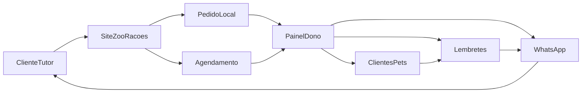

# Spec SDD — Site de Apoio ZooRações

**Status:** pronta para implementação  
**Loja MVP:** ZooRações  
**Tipo:** híbrido (vitrine + pedido local + agenda + clientes/pets/lembretes + painel + WhatsApp)  
**Stack:** agnóstica nesta spec  
**Spec irmã:** [[../specs/clientes-pets-lembretes|clientes-pets-lembretes]]

---

## 1. Contexto

Loja pet/veterinária local precisa de um site que organize pedidos na cidade, agenda de serviços e catálogo, reduzindo o caos do WhatsApp como “sistema improvisado”. O produto começa single-tenant (ZooRações) com modelo mental multi-loja (`loja_id`).

Documentação de produto: [[00 - Índice]] (pasta `docs/` do repositório).

---

## 2. Problema

- Pedidos e dúvidas ficam soltos no WhatsApp sem status
- Dono gasta tempo em ida e volta e risco de erro de estoque/agenda
- Cliente não tem caminho claro para pedir/agendar na cidade
- E-commerce nacional está fora do jogo; o valor é operação local

---

## 3. Objetivos

1. Permitir pedido local (retirada / entrega na cidade) com status no painel
2. Permitir solicitação de agendamento com confirmação pelo dono
3. Integrar WhatsApp como canal de confirmação/atendimento (deep link + disparo assistido no MVP)
4. Dar ao dono painel do dia: pedidos, agenda, lembretes, produtos/disponibilidade
5. Manter vitrine institucional útil (marca, horários, localização, serviços)
6. Cadastro de clientes/pets associados ao operador + lembretes de cuidado (vacina etc.)
7. Preparar conceitos para multi-loja sem construir SaaS agora

---

## 4. Não Objetivos

- Entrega/venda fora da cidade
- Marketplace / frete nacional
- ERP e fiscal completo
- App nativo
- Chatbot autônomo
- Billing multi-loja / self-serve
- WhatsApp Cloud API como bloqueante do MVP
- Prontuário clínico / portal do tutor (ver spec de lembretes)

Ver [[03 - Escopo do Produto/02 - Fora de Escopo|Fora de Escopo]].

---

## 5. Requisitos Funcionais

Resumo; detalhe canônico em [[03 - Escopo do Produto/03 - Requisitos Funcionais|RF]].

| Área | IDs |
| --- | --- |
| Vitrine | RF-V01–V03 |
| Catálogo | RF-C01–C04 |
| Pedido local | RF-P01–P07 |
| WhatsApp | RF-W01–W06 |
| Painel | RF-A01–A07 |
| Agenda | RF-S01–S05 |
| Clientes/Pets | RF-CL01–CL09 |
| Lembretes | RF-L01–L09 |
| Multi-loja prep | RF-M01–M02 |

---

## 6. Requisitos Não Funcionais

Ver [[03 - Escopo do Produto/04 - Requisitos Não Funcionais|RNF]].

Destaques: mobile-first, status como fonte da verdade, painel autenticado, regra de cidade configurável, logs mínimos de pedido/agenda/status.

---

## 7. Fluxos

### 7.1 Visão de sistema

### 7.2 Pedido local

Ver [[04 - Fluxos/03 - Pedido Local + WhatsApp|Pedido Local + WhatsApp]].

Estados: `novo` → `confirmado` → `preparando` → `pronto` → `entregue|retirado` | `cancelado`.

### 7.3 Agendamento

Ver [[04 - Fluxos/04 - Agendamento e Serviços|Agendamento e Serviços]].

Estados: `solicitado` → `confirmado` → `concluído` | `cancelado` | `no-show`.

### 7.4 Clientes, pets e lembretes

Ver [[08 - Clientes Pets e Lembretes/00 - Índice|módulo]] e [[../specs/clientes-pets-lembretes|spec dedicada]].

### 7.5 Jornadas

- Cliente: [[04 - Fluxos/01 - Jornada do Cliente|Jornada do Cliente]]
- Dono: [[04 - Fluxos/02 - Jornada do Dono|Jornada do Dono]]

---

## 8. Casos de Borda

Canônico em [[04 - Fluxos/05 - Casos de Borda|Casos de Borda]].

Obrigatórios na aceitação:

- Fora da cidade bloqueado com mensagem clara
- Produto indisponível não fecha pedido
- Cancelamento e no-show com status (não apagar)
- WhatsApp falha/API ausente: deep link ainda funciona

---

## 9. Impactos Técnicos (genéricos)

Stack não definida. Conceitos a mapear na implementação:

| Conceito | Responsabilidade |
| --- | --- |
| Serviço de catálogo | Produtos, disponibilidade, pausa |
| Serviço de pedidos | Carrinho/checkout, validação de área, status |
| Serviço de agenda | Serviços, slots/solicitações, status |
| Serviço de clientes/pets | CRUD + upsert telefone; associação a `usuario_id` |
| Serviço de cuidados/lembretes | Registro de cuidado, fila, status, vencimento |
| Auth | Operadores do painel |
| Config da loja | Branding, WhatsApp, horários, regra de cidade, `loja_id` |
| Adaptador WhatsApp | Deep links (produto, pedido, agenda, lembrete); futuro API |
| Persistência | Entidades com `loja_id` |
| Rotas públicas | Vitrine, catálogo, checkout, agendamento |
| Rotas privadas | Painel (pedidos, agenda, clientes, lembretes) |

### Entidades mínimas

`Loja`, `UsuarioOperador`, `Produto`, `Pedido`, `ItemPedido`, `Servico`, `Cliente`, `Pet`, `Agendamento`, `TipoCuidado`, `RegistroCuidado`, `Lembrete`, `ConfigWhatsApp` (pode ser campos em `Loja`).

### Integrações

| Integração | MVP | Depois |
| --- | --- | --- |
| WhatsApp deep link | Sim | — |
| WhatsApp Cloud API | Não | Sim se volume |
| Pagamento online | Opcional | Se dor real |
| Maps / geocode | Opcional p/ validar área | Melhorar UX |

---

## 10. Riscos

| Risco | Mitigação |
| --- | --- |
| Baixa adoção do painel | Rotina diária simples; onboarding focado |
| Catálogo desatualizado | Pausar produto em 1 ação |
| Escopo creep (ERP/frete) | Fora de escopo rígido |
| Dependência Meta API | MVP sem API |
| Multi-loja cedo | Só `loja_id` + config |

Ver também [[02 - Fluxo de Pensamento/03 - Hipóteses e Riscos|Hipóteses e Riscos]].

---

## 11. Critérios de Aceitação

### Pedido local

- [ ] Cliente monta carrinho e finaliza com retirada ou entrega na cidade
- [ ] Fora da cidade não conclui entrega/pedido indevido
- [ ] Pedido aparece no painel como `novo`
- [ ] Dono altera status até conclusão
- [ ] CTA WhatsApp carrega contexto do pedido

### Catálogo / vitrine

- [ ] Home mostra marca, horários, localização, serviços, CTAs
- [ ] Produto pausado não é comprável
- [ ] Mobile usável

### Agenda

- [ ] Cliente solicita serviço + pet + horário
- [ ] Dono confirma/cancela no painel
- [ ] Status visível e consistente
- [ ] Caminho WhatsApp de lembrete/confirmação existe

### Painel / WhatsApp

- [ ] Login do operador
- [ ] Fila do dia (pedidos + agenda + lembretes) acionável
- [ ] Botão/ação de avisar cliente via WhatsApp com texto útil
- [ ] Deep link funciona sem Cloud API

### Clientes / lembretes

- [ ] Cliente associado a operador + loja; pets na ficha
- [ ] Vacina registrada gera lembrete futuro
- [ ] Fila hoje / 7 dias / vencidos + avisar WhatsApp
- Critérios completos: [[../specs/clientes-pets-lembretes|spec clientes-pets-lembretes]]

### Multi-loja prep

- [ ] Entidades/conceitos incluem `loja_id` (fixo ok)
- [ ] Sem UI SaaS multi-tenant

---

## 12. Checklist de Implementação

Ordem sugerida (intenção, não tasks de repo):

1. [ ] Config da loja ZooRações (`loja_id`, WhatsApp, área, horários)
2. [ ] Auth do painel
3. [ ] Módulo Cliente/Pet (`usuario_id` + upsert telefone)
4. [ ] Catálogo + vitrine pública
5. [ ] Carrinho + checkout local + validação de cidade (+ vínculo cliente)
6. [ ] Painel de pedidos + status
7. [ ] Deep links WhatsApp (produto, pedido, genérico, lembrete)
8. [ ] Ação “avisar cliente” no painel
9. [ ] Serviços + agenda usando cadastro de pet/cliente
10. [ ] Cuidados + fila de lembretes
11. [ ] Casos de borda e mensagens de erro
12. [ ] Rotina/onboarding do dono (copy + UX)
13. [ ] Revisar hardcodes vs config (preparo multi-loja)

---

## Referências da documentação

- [[01 - Visão e Problema/04 - Norte do Produto|Norte do Produto]]
- [[02 - Fluxo de Pensamento/01 - Princípios de Decisão|Princípios de Decisão]]
- [[05 - WhatsApp e Operação/02 - Mensagens e Gatilhos|Mensagens e Gatilhos]]
- [[06 - Multi-loja (Futuro)/01 - Premissas de Tenant|Premissas de Tenant]]
- [[08 - Clientes Pets e Lembretes/00 - Índice|Clientes, Pets e Lembretes]]
- [[../specs/clientes-pets-lembretes|Spec clientes-pets-lembretes]]
