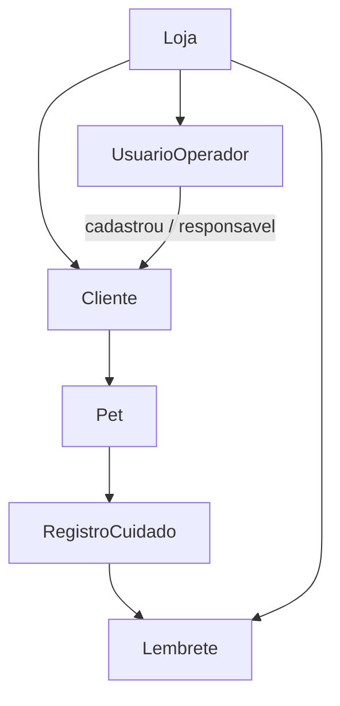

# Modelo de Domínio — Clientes, Pets e Lembretes

## Ideia central

O tutor (**Cliente**) e o animal (**Pet**) deixam de ser “dados leves só da agenda” e passam a ser o **cadastro da loja**. Em cima do pet, a loja registra cuidados (ex.: vacina) e o sistema gera **lembretes** de retorno.

## Associações

| Relação | Regra |
| --- | --- |
| `Cliente` → `loja_id` | Cliente pertence à loja (obrigatório) |
| `Cliente` → `usuario_id` | Operador que cadastrou / é responsável (obrigatório no MVP) |
| `Pet` → `cliente_id` | Pet pertence a um tutor |
| `RegistroCuidado` → `pet_id` | Ex.: vacina V10 aplicada em 01/08/2026 |
| `Lembrete` → cuidado e/ou pet | Próxima ação (ex.: revacinar em 01/08/2027) |

## Por que associar Cliente a Usuario?

- Na operação real, quem atendeu/cadastrou acompanha o relacionamento
- No futuro multi-operador: filtrar “meus clientes” vs “todos da loja”
- Auditoria simples: quem criou o cadastro

No MVP single-user da ZooRações, `usuario_id` ainda existe (mesmo que só haja um operador).

## Entidades e campos mínimos

### UsuarioOperador
- id, loja_id, nome, login, ativo

### Cliente
- id, loja_id, usuario_id (responsável)
- nome, telefone/WhatsApp (obrigatório)
- e-mail (opcional), endereço na cidade (opcional)
- observações, ativo, created_at

### Pet
- id, cliente_id, loja_id
- nome, espécie, porte/raça (opcional), sexo (opcional), nascimento/idade aprox. (opcional)
- observações, ativo

### TipoCuidado (catálogo configurável)
- id, loja_id (ou global da loja)
- nome (Vacina V10, Antirrábica, Vermífugo, Antipulgas, Retorno, Outro)
- intervalo_padrao_dias (opcional — sugestão ao criar lembrete)
- ativo

### RegistroCuidado
- id, pet_id, loja_id, usuario_id (quem registrou)
- tipo_cuidado_id
- data_realizacao
- observações / lote (opcional, texto livre — sem prontuário clínico)
- proxima_data (pode espelhar o lembrete gerado)

### Lembrete
- id, loja_id, pet_id, cliente_id
- tipo_cuidado_id (ou título livre)
- data_prevista
- status: `pendente` | `vencido` | `avisado` | `concluido` | `dispensado`
- origem: `manual` | `pos_cuidado` | `agenda`
- registro_cuidado_origem_id (opcional)
- avisado_em (opcional)

## O que isto NÃO é

- Prontuário veterinário / CRMV / prescrição
- Controle farmacêutico de vacina (estoque de doses, validade de lote obrigatório)
- Portal do tutor com login (cliente não é “usuário do sistema” no MVP)

Cliente = dado da loja. Usuario = quem opera o painel.

## Relacionados

- [[02 - Cadastro de Clientes e Pets]]
- [[03 - Sistema de Lembretes]]
