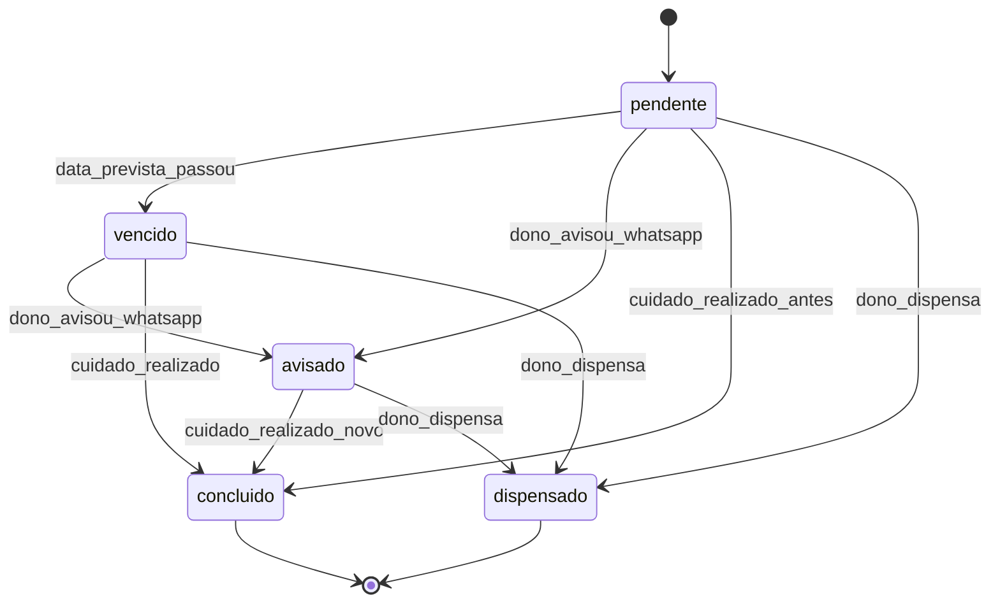

# Sistema de Lembretes

## Problema que resolve

Exemplo: pet toma vacina hoje; daqui a meses precisa revacinar. Sem sistema, o retorno depende de memória, papel ou chat — e a loja perde a oportunidade de chamar o cliente.

## Princípio

> Lembrete vive no sistema (painel). WhatsApp comunica. O dono decide o tom/hora do aviso no MVP (disparo assistido).

Alinha com [[05 - WhatsApp e Operação/01 - Papel do WhatsApp|Papel do WhatsApp]].

## Como um lembrete nasce

| Origem | Exemplo |
| --- | --- |
| Pós-cuidado | Operador registra “Vacina V10 em 01/08/2026” e informa próxima data (ou usa intervalo padrão) → cria lembrete |
| Manual | Operador cria lembrete na ficha do pet (“Vermífugo em 90 dias”) |
| Pós-agenda (opcional) | Ao concluir banho/consulta, sugerir próximo retorno |

## Ciclo de vida

| Status | Significado |
| --- | --- |
| `pendente` | Ainda não venceu / aguardando ação |
| `vencido` | Passou da data sem conclusão |
| `avisado` | Dono já acionou WhatsApp (ou marcou como avisado) |
| `concluido` | Novo cuidado realizado; ciclo fechado (pode gerar próximo lembrete) |
| `dispensado` | Não vai seguir (cliente mudou, pet óbito, etc.) |

## Fila do painel

Vista principal do dono:

- Lembretes **hoje**
- Lembretes **próximos 7 dias**
- Lembretes **vencidos**
- Filtros: tipo de cuidado, responsável (`usuario_id`), busca pet/cliente

Ação em cada item:

1. Abrir ficha do pet/cliente
2. **Avisar no WhatsApp** (mensagem pré-preenchida)
3. **Registrar cuidado** (conclui lembrete + opcionalmente cria o próximo)
4. **Dispensar** (com motivo curto opcional)
5. **Adiar** (nova `data_prevista`)

## Canais no MVP

| Canal | MVP |
| --- | --- |
| Painel (fila) | Sim — obrigatório |
| WhatsApp assistido | Sim — obrigatório |
| WhatsApp automático (API) | Evolução |
| E-mail / push / SMS | Fora do MVP |
| Notificação para o tutor logado | Não (sem portal do tutor) |

## Tipos de cuidado iniciais (sugestão ZooRações)

- Vacina (genérica / V10 / antirrábica — configurável)
- Vermífugo
- Antipulgas / carrapaticida
- Retorno de consulta / avaliação
- Outro (texto livre + data)

Intervalo padrão é **sugestão**, editável por registro (nem todo protocolo é igual).

## Relacionados

- [[04 - Fluxo Vacinação e Retorno]]
- [[05 - WhatsApp e Operação/02 - Mensagens e Gatilhos|Mensagens e Gatilhos]]
