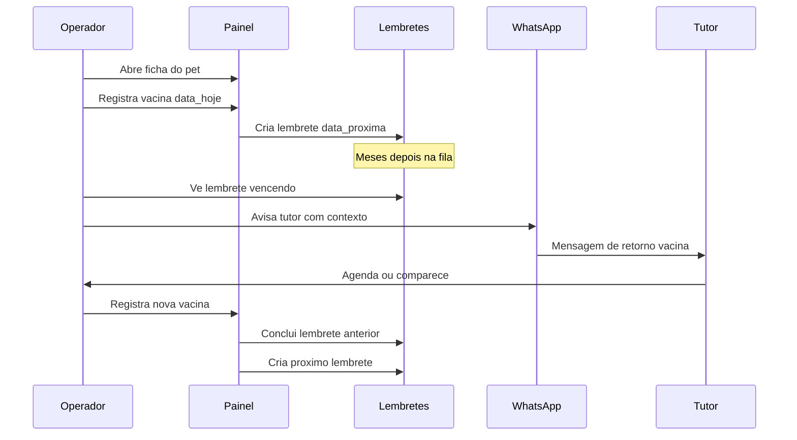

# Fluxo — Vacinação e Retorno

## Fluxo feliz

## Passo a passo

1. Tutor/pet já cadastrados (ou cadastra na hora)
2. Operador registra cuidado: tipo Vacina, data, obs. opcional
3. Sistema sugere próxima data (intervalo padrão do tipo) — operador confirma/edita
4. Lembrete fica `pendente`
5. Quando entrar na janela (hoje / 7 dias / vencido), aparece na fila
6. Operador avisa no WhatsApp
7. Tutor retorna → novo registro de vacina → lembrete antigo `concluido` → novo lembrete

## Mensagem WhatsApp (modelo)

> Olá, {nome_cliente}! Aqui é a ZooRações.  
> O {nome_pet} está perto da data de {tipo_cuidado} ({data_prevista}).  
> Quer agendar ou tirar dúvida? Estamos à disposição.

## Casos de borda

| Caso | Comportamento |
| --- | --- |
| Operador não informa próxima data | Não cria lembrete (ou pergunta se deseja criar) |
| Pet sem telefone no tutor | Lembrete só no painel; bloquear WhatsApp com aviso |
| Tutor não responde | Lembrete segue `avisado` ou volta a destacar como vencido |
| Pet inativo / óbito | Dispensar lembretes abertos |
| Duas vacinas diferentes | Dois lembretes independentes no mesmo pet |
| Adiar | Só muda `data_prevista`; status volta a `pendente` se estava vencido |

## Relacionados

- [[03 - Sistema de Lembretes]]
- [[02 - Cadastro de Clientes e Pets]]
