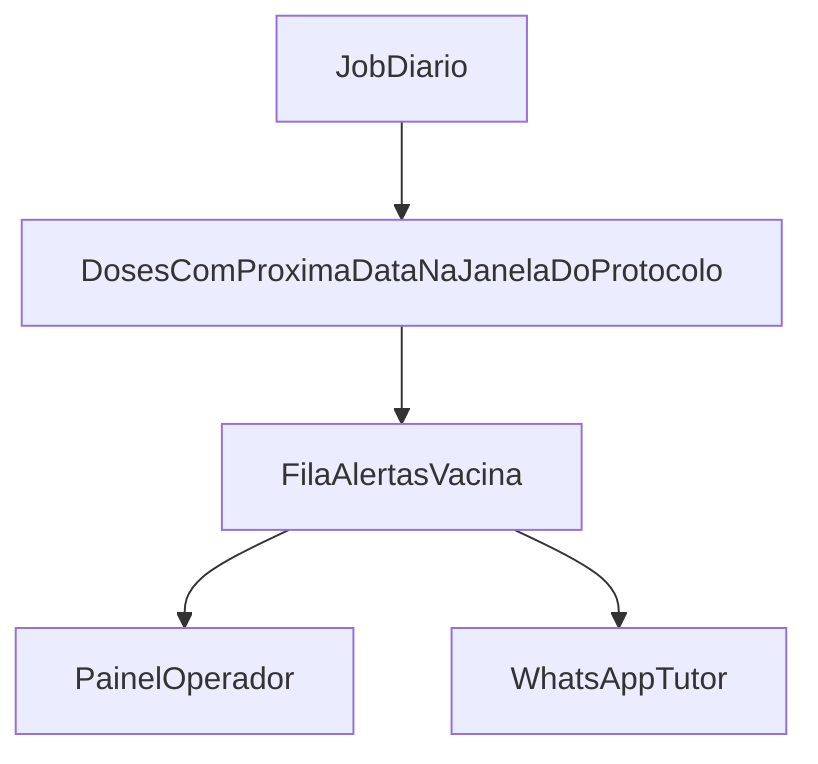

# Módulo — Vacinação

Módulo próprio (não misturar com “lembrete genérico” na UX). Por baixo, reutiliza a ideia de cuidado + data próxima.

## Carteira de vacinação (exemplo)

```text
Pet: Thor

Vacina          Data          Próxima dose
--------------------------------------------
V10             10/02/2026    10/03/2027
Antirrábica      10/02/2026    10/02/2027
Giárdia          15/02/2026    15/02/2027
```

**Bounded Context:** Imunização · **Feature:** `imunizacao`

## Campos do registro de vacina

| Campo | Descrição |
| --- | --- |
| Pet | Obrigatório |
| Vacina (tipo) | V10, antirrábica, giárdia, etc. (catálogo) |
| Fabricante | Opcional |
| Lote | Opcional |
| Data de aplicação | Obrigatório |
| Veterinário | Responsável pela aplicação |
| Próxima dose | Data (gera alerta) |
| Observações | Opcional |

## Protocolo por tipo de vacina

O intervalo **não é fixo global**. Cada tipo de vacina tem seu próprio protocolo, configurável na loja:

| Configuração | Exemplo |
| --- | --- |
| Intervalo de reforço | 6 meses, 12 meses, 21 dias (dose inicial) |
| Nº de doses da série inicial | ex.: 3 doses com 21 dias |
| Janela de alerta | ex.: avisar 30 dias antes; 15 dias para intervalo curto |
| Quem aplica | Veterinário responsável (a ZooRações tem **1 veterinário**) |

Ao registrar a dose, o sistema **sugere** a próxima data pelo protocolo e o veterinário confirma ou ajusta — o caso concreto sempre pode divergir do padrão.

## Funcionalidades

1. Registro de vacina (com lote/fabricante/vet)
2. Carteira digital por pet
3. Histórico completo de aplicações
4. Protocolo configurável por tipo de vacina (intervalo + janela de alerta)
5. Identificação automática de pets com dose vencendo dentro da janela do protocolo
6. Fila de alertas no painel
7. Disparo de mensagem ao tutor (WhatsApp) — assistido primeiro; automático quando habilitado

## Alerta por janela do protocolo



## RF

RF-VAC01–VAC11 em [[../REQUISITOS-FUNCIONAIS|REQUISITOS-FUNCIONAIS.md]].

## Relacionados

- [[04 - WhatsApp Eventos]]
- [[08 - Clientes Pets e Lembretes/03 - Sistema de Lembretes|Lembretes (base)]]
