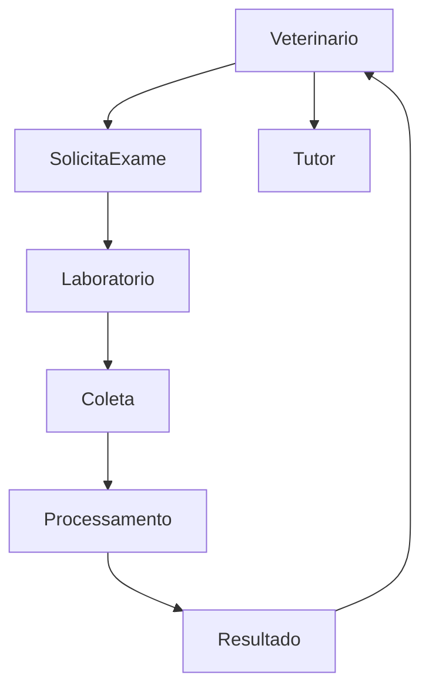

# Módulo — Laboratório

Deixa o sistema mais profissional no eixo clínico-diagnóstico.

## Catálogo de exames (exemplos)

- Hemograma
- Bioquímica
- Urina
- Fezes
- Citologia
- Outros / pacotes

## Fluxo

## Funcionalidades

- Catálogo de exames
- Pacotes de exames
- Solicitação
- Coleta
- Status do exame
- Resultado
- Valores de referência
- Laudo
- PDF
- Assinatura (responsável)
- Histórico por pet
- Envio ao tutor (WhatsApp / download)

## Status sugeridos

`solicitado` → `coleta_pendente` → `em_processamento` → `resultado_disponivel` → `entregue_tutor` | `cancelado`

## RF

RF-LAB01–LAB10 em [[03 - Escopo do Produto/03 - Requisitos Funcionais|Requisitos Funcionais]].

## Fase

**G** — após prontuário básico (Fase E) ter solicitação/resultado simples; lab é a versão completa com fluxo interno.

## Relacionados

- [[05 - Prontuario Veterinario]]
- [[04 - WhatsApp Eventos]]
