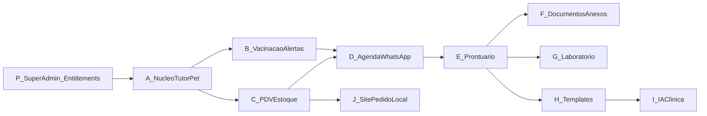

# Faseamento do Produto

A visão completa é um **sistema veterinário + varejo**. Entregar tudo de uma vez atrasa valor. Fasear.

> A ordem entre módulos é **flexível**. O que é obrigatório: cada implementação pertence a um **Bounded Context** e é exposta por **feature/capability** nos entitlements. Ver [[10 - Arquitetura/04 - Regras de Implementacao|Regras de Implementação]].

## Diagrama

## Fases

| Fase | Nome | Entrega principal | Critério de saída |
| --- | --- | --- | --- |
| **P** | Plataforma mínima | Super Admin, cadastro de loja, Feature Entitlements, ZooRações como tenant | Dá para criar loja e ligar/desligar módulos |
| **A** | Núcleo | Tutor + Animal (campos ricos), busca, ficha, vínculo usuário/loja; entitlement `nucleo_clientes_pets` ON | Loja cadastra atendimentos reais sem planilha |
| **B** | Vacinação | Carteira, registro (lote/fabricante/vet), alerta 30 dias, WhatsApp | Retornos de vacina saem da memória |
| **C** | PDV / estoque | Venda balcão, pagamentos, baixa estoque, histórico compras | Balcão vende pelo sistema |
| **D** | Agenda + WhatsApp eventos | Consulta/banho, lembretes, eventos WhatsApp | Agenda e avisos no mesmo lugar |
| **E** | Prontuário | Consulta, anamnese, vitais, diagnóstico, prescrição | Veterinário registra atendimento no sistema |
| **F** | Documentos | Receitas, atestados, laudos, anexos | Documentos saem do prontuário |
| **G** | Laboratório | Fluxo exame ponta a ponta + laudo | Lab interno ou fluxo controlado |
| **H** | Templates | Modelos dermato/cardio/felino etc. | Consulta mais rápida |
| **I** | IA clínica | Texto livre → SOAP/anamnese revisável | Tempo de documentação cai |
| **J** | Site / pedido local | Vitrine + e-commerce cidade (docs 01–07) | Pode paralelizar com C |

Cada fase, ao ficar pronta para uso na ZooRações, **liga o Feature Entitlement** correspondente no Super Admin.

## O que NÃO fazer

- Começar pela IA ou pelo laboratório completo
- Prontuário sem núcleo Tutor/Pet sólido
- PDV sem baixa de estoque
- Billing/self-serve antes de ter segunda loja real
- Esconder feature só no menu sem bloquear API (entitlement deve valer no backend)

## Relação com o “MVP antigo”

O MVP de site + pedido + WhatsApp vira **Fase J** (paralela) + pedaços de **A/B/C/D**. O **núcleo A** passa a ser a fundação — alinhado ao que você descreveu.

## Relacionados

- [[00 - Índice]]
- [[02 - Fluxo de Pensamento/04 - Roadmap Mental (MVP → multi-loja)|Roadmap antigo — substituído na prática por este]]
