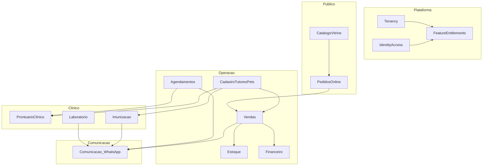

# Bounded Contexts

Cada domínio é **isolado** e responsável pelas suas próprias regras de negócio. Nenhuma implementação nova entra “solta”: ela sempre pertence a um contexto e é exposta via entitlements.

## Mapa de contextos

## Catálogo de contextos

| Bounded Context | Responsabilidade (regras próprias) | Não é responsável por |
| --- | --- | --- |
| **Tenancy** | Loja/tenant, status, branding, config operacional | Regras de negócio de módulo |
| **Identity & Access** | Usuários, autenticação, papéis (super admin, admin loja, operador, vet) | Quais módulos a loja tem |
| **Feature Entitlements** | Catálogo de features/capabilities e o que cada tenant possui | Executar regra de domínio |
| **Cadastro (Tutores & Pets)** | Tutor, Pet, vínculos, dados de identificação, deduplicação por telefone | Vacina, venda, prontuário |
| **Imunização** | Vacinas, carteira, protocolo/intervalo, doses, próxima dose | Enviar mensagem, agendar horário |
| **Prontuário Clínico** | Consulta, anamnese, vitais, diagnóstico, prescrição, documentos clínicos | Exame laboratorial interno, cobrança |
| **Laboratório** | Catálogo de exames, solicitação, coleta, resultado, laudo | Interpretação clínica final |
| **Agendamentos** | Serviços, horários, status, no-show | Executar venda, prontuário |
| **Estoque** | Produtos, saldo, movimentações, reserva, ruptura | Preço final da venda, pagamento |
| **Vendas** | Venda, itens, totais, cupom/comprovante | Saldo de estoque, liquidação financeira |
| **Financeiro** | Pagamentos, formas, parcelas, recebíveis, pendências | Estoque, catálogo |
| **Catálogo/Vitrine** | Exposição pública de produtos e serviços | Estoque real (consulta, não decide) |
| **Pedidos Online** | Pedido local, área de atendimento, status | Baixa de estoque (delega a Vendas/Estoque) |
| **Comunicação (WhatsApp)** | Templates, envio, registro de comunicação, modo assistido/automático | Regra que originou o evento |

## Regras de fronteira

1. Um contexto **é dono** dos seus dados e invariantes
2. Outro contexto não escreve direto no banco do vizinho — usa **caso de uso / evento**
3. Toda entidade de negócio carrega `loja_id` (tenant)
4. Contexto **não pergunta** “esta loja tem essa feature?” — quem decide é a camada de entitlement (ver [[02 - Capabilities e Entitlements]])
5. Uma nova funcionalidade sempre é anexada a **um** contexto e a **uma capability**

## Exemplo de fronteira: venda de ração

| Contexto | Papel na operação |
| --- | --- |
| Vendas | Cria venda, itens, total, confirma |
| Estoque | Recebe evento e baixa saldo (regra de ruptura é dele) |
| Financeiro | Registra pagamento(s), parcelas |
| Cadastro | Vincula tutor (se houver) |
| Comunicação | Evento `venda.registrada` → mensagem opcional |

Nenhum deles precisa saber se a loja “tem PDV” — isso é filtrado antes, no entitlement.

## Relacionados

- [[02 - Capabilities e Entitlements]]
- [[03 - Integracao entre Contextos]]
