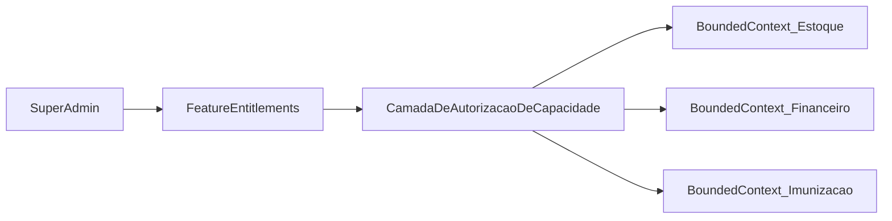

# Capabilities e Feature Entitlements

## Modelo em três níveis

```text
Bounded Context   →  domínio e regras (ex.: Estoque)
Feature           →  módulo comercializável / ativável (ex.: estoque)
Capability        →  operação granular dentro da feature (ex.: estoque.ajuste_manual)
```

O **Super Admin** configura features e capabilities por loja. Os contextos não conhecem essa configuração.



## Convenção de nomes

| Item | Formato | Exemplo |
| --- | --- | --- |
| Feature | `snake_case` do módulo | `estoque`, `financeiro`, `imunizacao` |
| Capability | `feature.acao` | `estoque.ajuste_manual`, `vendas.cancelar` |

Feature ligada = módulo visível.  
Capability ligada = operação permitida dentro do módulo.

## Catálogo: contexto → feature → capabilities

| Bounded Context | Feature | Capabilities (exemplos) |
| --- | --- | --- |
| Cadastro | `cadastro` | `cadastro.tutor_crud`, `cadastro.pet_crud`, `cadastro.exportar` |
| Imunização | `imunizacao` | `imunizacao.registrar_dose`, `imunizacao.carteira`, `imunizacao.alertas`, `imunizacao.protocolo_config` |
| Prontuário | `prontuario` | `prontuario.consulta`, `prontuario.prescricao`, `prontuario.documentos` |
| Laboratório | `laboratorio` | `laboratorio.solicitar`, `laboratorio.resultado`, `laboratorio.laudo_pdf` |
| Agendamentos | `agendamentos` | `agendamentos.criar`, `agendamentos.remarcar`, `agendamentos.servicos_config` |
| Estoque | `estoque` | `estoque.produtos_crud`, `estoque.movimentacao`, `estoque.ajuste_manual`, `estoque.inventario` |
| Vendas | `vendas` | `vendas.registrar`, `vendas.cancelar`, `vendas.desconto` |
| Financeiro | `financeiro` | `financeiro.pagamentos`, `financeiro.parcelamento`, `financeiro.recebiveis` |
| Catálogo/Vitrine | `vitrine` | `vitrine.publicar`, `vitrine.servicos` |
| Pedidos Online | `pedido_online` | `pedido_online.checkout`, `pedido_online.entrega_local` |
| Comunicação | `whatsapp` | `whatsapp.assistido`, `whatsapp.automatico`, `whatsapp.templates` |
| IA clínica | `ia_clinica` | `ia_clinica.estruturar_texto` |
| Templates | `templates_consulta` | `templates_consulta.crud`, `templates_consulta.usar` |

## Exemplo prático (o cenário que você citou)

| Loja | Features |
| --- | --- |
| Loja A | `cadastro`, `estoque` |
| Loja B | `cadastro`, `estoque`, `financeiro` |
| ZooRações | conforme o que já está pronto |

Mesmo código. Configuração diferente por tenant.

## Onde o entitlement é aplicado

| Camada | Comportamento |
| --- | --- |
| Menu / UI | Só mostra features ON |
| Rotas / API | Bloqueia se feature ou capability OFF |
| Casos de uso | Guard antes de entrar no domínio |
| Jobs / schedulers | Não processam tenant com feature OFF |
| Eventos / integrações | Consumidor de contexto desligado ignora o evento |

**Regra:** UI esconde, backend bloqueia. Nunca só esconder.

## Como o contexto fica “limpo”

O contexto recebe a operação já autorizada:

```text
Requisição
  → Identidade (quem é, de qual loja)
  → Entitlement guard (loja tem feature/capability?)
  → Caso de uso do Bounded Context (regras de negócio)
```

O domínio de Estoque não tem `if (loja.temFinanceiro)`. Isso é responsabilidade da camada anterior.

## Papel × Entitlement

São coisas diferentes e ambas precisam passar:

| Pergunta | Quem responde |
| --- | --- |
| A loja tem essa capacidade? | Feature Entitlements |
| Este usuário pode executar? | Identity & Access (papel/permissão) |

Ex.: loja tem `estoque.ajuste_manual`, mas o atendente não tem permissão — bloqueado pelo papel.

## Relacionados

- [[01 - Bounded Contexts]]
- [[04 - Regras de Implementacao]]
- [[06 - Multi-loja (Futuro)/04 - Catalogo de Features|Catálogo de Features]]
