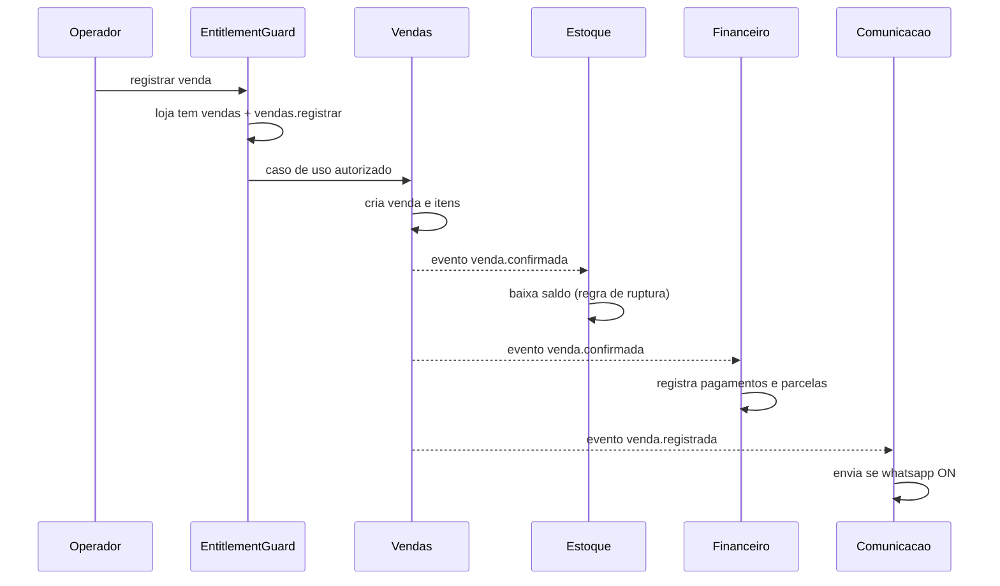

# Integração entre Contextos

Contextos conversam por **eventos de domínio** e casos de uso explícitos — nunca por acesso direto a tabelas do vizinho.

## Fluxo de exemplo: venda no balcão

Se a loja **não tem** `financeiro`, o evento simplesmente não tem consumidor ativo — Vendas não muda.

## Eventos principais por contexto

| Contexto | Publica | Consome |
| --- | --- | --- |
| Cadastro | `tutor.criado`, `pet.criado` | `venda.confirmada` (histórico), `agendamento.criado` |
| Imunização | `dose.aplicada`, `vacina.vencendo` | `pet.criado` |
| Vendas | `venda.confirmada`, `venda.cancelada` | `pedido_online.confirmado` |
| Estoque | `estoque.baixo`, `estoque.ruptura` | `venda.confirmada`, `venda.cancelada` |
| Financeiro | `pagamento.registrado`, `titulo.vencido` | `venda.confirmada` |
| Agendamentos | `agendamento.confirmado`, `servico.concluido` | `dose.aplicada` (sugerir retorno) |
| Prontuário | `consulta.registrada`, `receita.emitida` | `exame.resultado_disponivel` |
| Laboratório | `exame.solicitado`, `exame.resultado_disponivel` | `consulta.registrada` |
| Comunicação | `mensagem.enviada` | todos os eventos com template |
| Pedidos Online | `pedido_online.confirmado` | `estoque.ruptura` (indisponibilizar) |

## Regras de integração

1. Evento é **fato passado** (`venda.confirmada`), não comando
2. Publicador não sabe quem consome
3. Consumidor idempotente (reprocessar não duplica baixa de estoque)
4. Todo evento carrega `loja_id`
5. Consumo é filtrado por entitlement do tenant
6. Sem entitlement → evento registrado, ação não executada

## Anti-padrões a evitar

- Vendas escrevendo direto na tabela de estoque
- Prontuário consultando entitlements para decidir regra clínica
- Contexto “Geral” que faz tudo
- Evento com nome de comando (`baixarEstoque`)
- Compartilhar entidade mutável entre contextos (usar referência por id)

## Relacionados

- [[01 - Bounded Contexts]]
- [[02 - Capabilities e Entitlements]]
